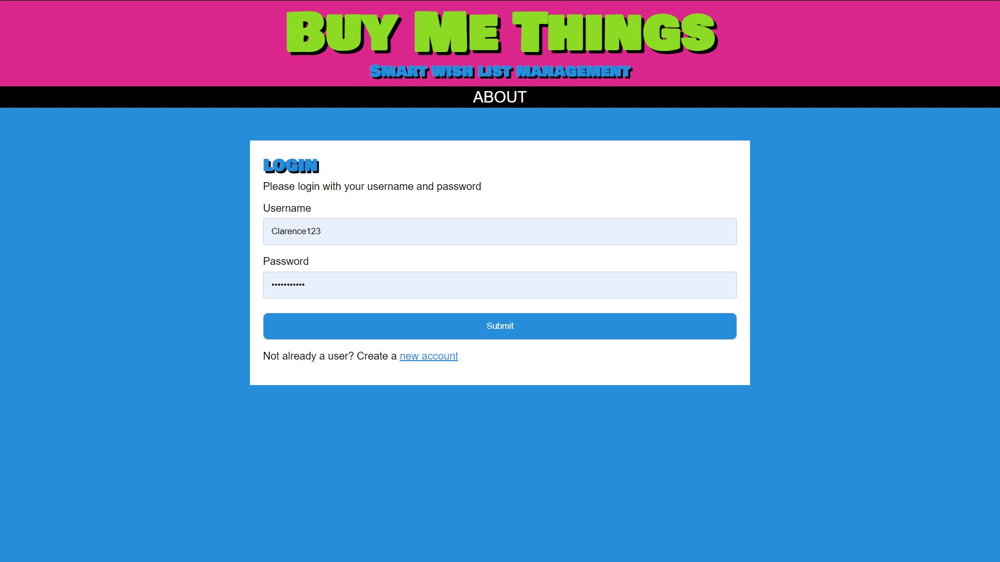
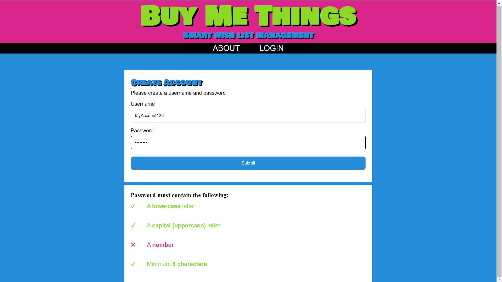
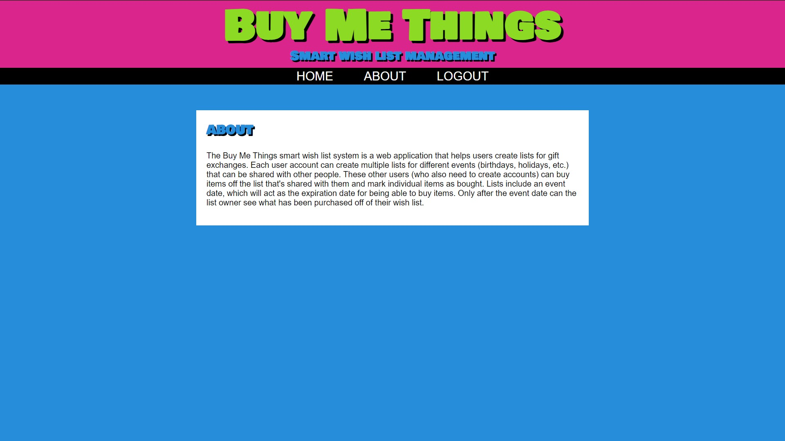
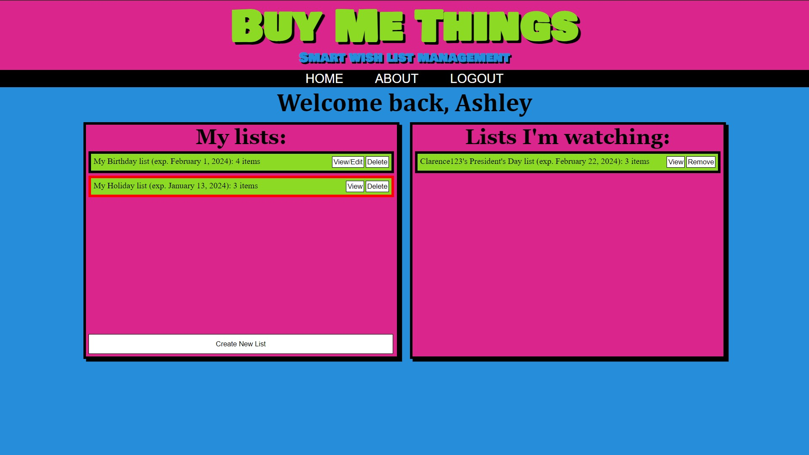
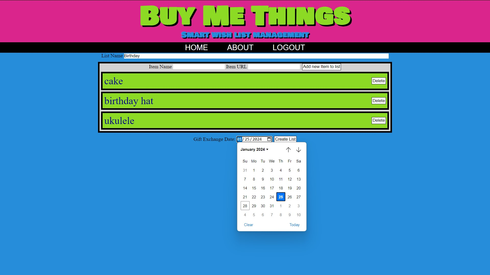
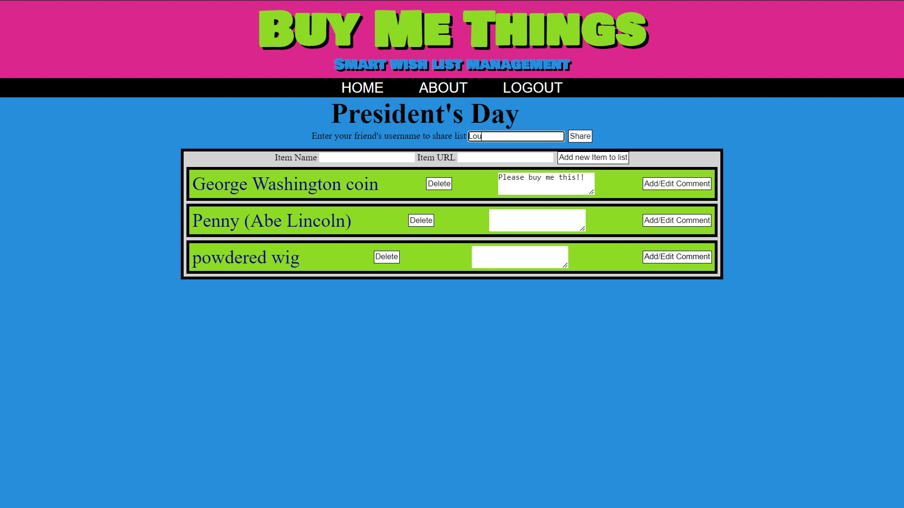
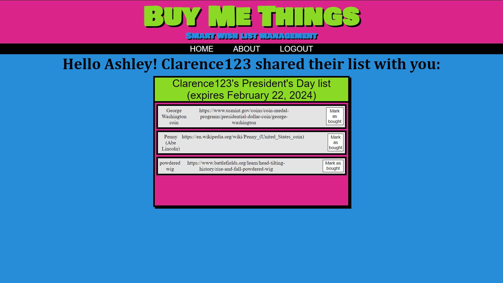
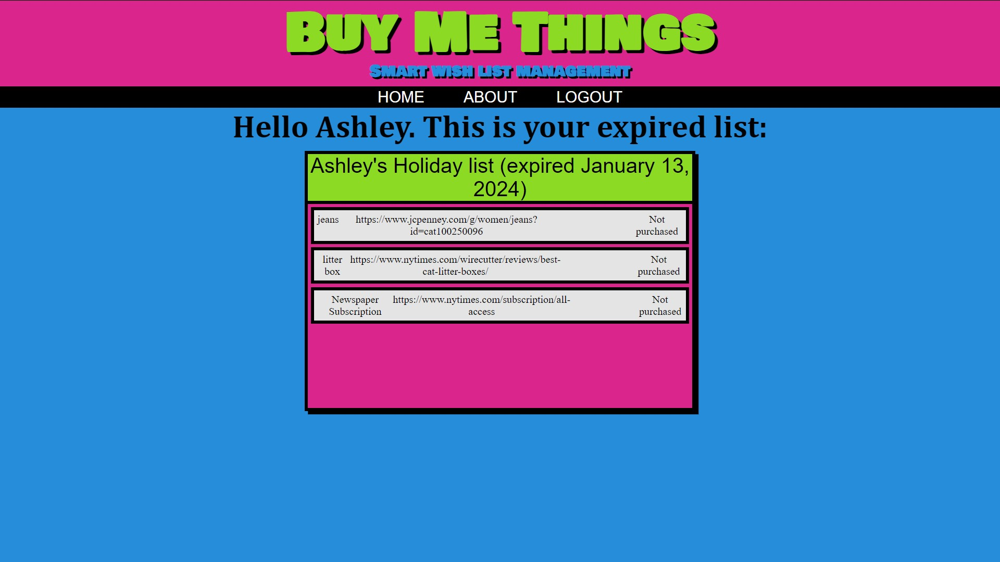

# Wish List

## Description

The Buy Me Things smart wish list system is a web application that helps users create lists for gift exchanges. Each user account can create multiple lists for different events (birthdays, holidays, etc.) that can be shared with other people. These other users (who also need to create accounts) can buy items off the list that's shared with them and mark individual items as bought. Lists include an event date, which will act as the expiration date for being able to buy items. Only after the event date can the list owner see what has been purchased off of their wish list.

## Installation

Clone the repo from https://github.com/rbenjamin4/WishList

Download and install Node.js from https://nodejs.org/en/download/current

Download and install PostgreSQL from https://www.postgresql.org/download/

In PostgreSQL you will need to set the database name to 'user_db'

## Usage

After creating an account the user will be directed to the home page. The home page contains two lists: lists owned by the current user and lists that have been shared with the current user. On the home page, the user may click on view/edit list under My lists to see a list of items on the list and edit that list. Under the section of My list, the user may click on Create New List to be taken to the page to create a new list. The user may also click on view list on shared lists to see the items on a list shared with them. The user also has the option to manage lists, either deleting lists they own or removing lists from their shared lists. To create a new list, the user must enter a list name, add an expiration date to the list (ideally the date of the gift exchange), and add an item to the list. To add an item, the user must fill out the item name and item url fields. On the view/edit list page, the user may add or remove items from their list, share the list with other users, and/or add comments to items on the list. Under view shared lists, the user may mark unbought items as bought to let other users know that item is taken. From any page, the user may click on ABOUT to be directed to a page describing how to use this application. If the user wishes to log out, they may either click LOGOUT or simply close the tab.

## Credits

Developers:
[George Bell](https://github.com/gbell76)
[Reed Benjamin](https://github.com/rbenjamin4)
[Bryan Schneller](https://github.com/ChairSitter)

The create account password validation was built with code from https://www.w3schools.com/howto/tryit.asp?filename=tryhow_js_password_val

## License 

MIT License

Copyright (c) 2024 George Bell, Reed Benjamin, and Bryan Schneller

Permission is hereby granted, free of charge, to any person obtaining a copy of this software and associated documentation files (the "Software"), to deal in the Software without restriction, including without limitation the rights to use, copy, modify, merge, publish, distribute, sublicense, and/or sell copies of the Software, and to permit persons to whom the Software is furnished to do so, subject to the following conditions:

The above copyright notice and this permission notice shall be included in all copies or substantial portions of the Software.

THE SOFTWARE IS PROVIDED "AS IS", WITHOUT WARRANTY OF ANY KIND, EXPRESS OR IMPLIED, INCLUDING BUT NOT LIMITED TO THE WARRANTIES OF MERCHANTABILITY, FITNESS FOR A PARTICULAR PURPOSE AND NONINFRINGEMENT. IN NO EVENT SHALL THE AUTHORS OR COPYRIGHT HOLDERS BE LIABLE FOR ANY CLAIM, DAMAGES OR OTHER LIABILITY, WHETHER IN AN ACTION OF CONTRACT, TORT OR OTHERWISE, ARISING FROM, OUT OF OR IN CONNECTION WITH THE SOFTWARE OR THE USE OR OTHER DEALINGS IN THE SOFTWARE.

## URL
https://smart-wish-list.onrender.com/

## Screenshots

